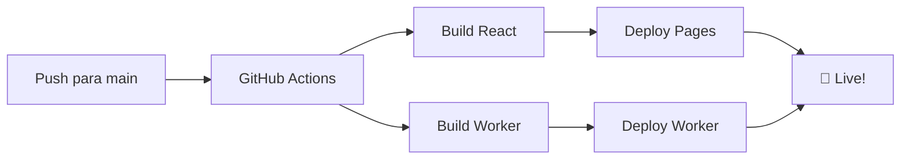

# 🎮 MEU PORTFÓLIO - Hollow Knight Theme

> Um portfólio full-stack moderno com tema Hollow Knight, desenvolvido com React, TypeScript, Cloudflare Workers e Resend para envio de emails.


---

## 🌟 Features

- ✅ **Frontend React** - Interface moderna com tema Hollow Knight
- ✅ **Backend Cloudflare Workers** - Serverless API em produção
- ✅ **Contact Form** - Formulário de contato com validação
- ✅ **Email Automation** - Integração com Resend para envio de emails
- ✅ **GitHub Actions CI/CD** - Deploy automático para Cloudflare Pages
- ✅ **TypeScript** - Type-safe em todo o projeto
- ✅ **Responsive Design** - Mobile-first com glassmorphism
- ✅ **CORS Enabled** - API pronta para produção

---

## 🚀 Quick Start

### Pré-requisitos
- Node.js 18+
- npm ou yarn
- Conta Cloudflare (free tier ok)
- Conta GitHub

### 1️⃣ Clonar e Instalar
```bash
git clone https://github.com/LevyTavares/meu-portfolio.git
cd meu-portfolio
npm install

# Instalar dependências do worker
cd worker
npm install
cd ..
```

### 2️⃣ Configurar Variáveis de Ambiente
```bash
# Frontend - criar .env.local
echo "VITE_API_URL=http://localhost:45181" > .env.local

# Worker - criar .env
cd worker
echo "RESEND_API_KEY=re_seu_api_key" > .env
cd ..
```

### 3️⃣ Rodar em Desenvolvimento
```bash
# Terminal 1 - Frontend (porta 5173)
npm run dev

# Terminal 2 - Worker (porta 45181)
cd worker && npm run dev
```

Acesse: http://localhost:5173

---

## 📁 Estrutura do Projeto

```
meu-portfolio/
├── src/
│   ├── components/
│   │   └── ContactForm.tsx      # Formulário de contato
│   ├── lib/
│   │   └── api.ts               # Cliente HTTP
│   ├── styles/
│   │   └── contact-form.css     # Estilos do formulário
│   ├── App.tsx                  # Componente principal
│   └── main.tsx
├── worker/
│   ├── src/
│   │   └── index.ts             # API Cloudflare Workers
│   ├── wrangler.toml            # Configuração do Worker
│   └── package.json
├── .github/
│   └── workflows/
│       └── deploy.yml           # GitHub Actions CI/CD
└── README.md
```

---

## 📚 Documentação Completa

### Guias Essenciais
- 📖 [SETUP_SUMMARY.md](./SETUP_SUMMARY.md) - **Resumo rápido de setup**
- 🎯 [EXECUTIVE_SUMMARY.md](./EXECUTIVE_SUMMARY.md) - **Visão geral do projeto**

### Configuração e Deployment
- ⚙️ [INTEGRATION_GUIDE.md](./INTEGRATION_GUIDE.md) - **Integração frontend + backend**
- 🔧 [CLOUDFLARE_WORKERS_SETUP.md](./CLOUDFLARE_WORKERS_SETUP.md) - **Setup do Worker**
- 🚀 [PRODUCTION_DEPLOY_GUIDE.md](./PRODUCTION_DEPLOY_GUIDE.md) - **Deploy em produção**

### Email e Resend
- 📧 [RESEND_SETUP.md](./RESEND_SETUP.md) - **Configurar Resend**
- 📮 [RESEND_IMPLEMENTATION.md](./RESEND_IMPLEMENTATION.md) - **Implementação de emails**
- 🧪 [TESTE_EMAIL_GUIA.md](./TESTE_EMAIL_GUIA.md) - **Guia de testes de email**

---

## 🔌 API Endpoints

### Health Check
```bash
GET /api/health
# Response: { "status": "ok", "timestamp": "2026-05-12T..." }
```

### Contact Form
```bash
POST /api/contact
Content-Type: application/json

{
  "name": "João",
  "email": "joao@example.com",
  "message": "Adorei seu portfólio!"
}

# Response: { "success": true, "message": "Mensagem recebida com sucesso!" }
```

### Get Projects
```bash
GET /api/projects
# Response: Array de projetos
```

---

## 🎨 Design & Tema

### Cores Hollow Knight
- **Fundo Vazio**: `#020204`
- **Azul Neon**: `#6ba3ff`
- **Glassmorphism**: `backdrop-filter: blur(10px)`
- **Borders**: `2px solid`

### Components
- Smooth animations e transitions
- Glow effects com box-shadow
- Responsive grid layout
- Mobile-first approach

---

## 🔐 Segurança

- ✅ CORS headers configurados
- ✅ Email validation regex
- ✅ TypeScript strict mode
- ✅ API Key em GitHub Secrets (não commitado)
- ✅ HTTPS em produção

---

## 📊 Variáveis de Ambiente

### Frontend (.env.local)
```env
VITE_API_URL=http://localhost:45181  # Dev
VITE_API_URL=https://seu-worker.workers.dev  # Prod
```

### Worker (.env)
```env
RESEND_API_KEY=re_xxxxxxxxxxxxxxxx
```

### GitHub Secrets
- `RESEND_API_KEY` - API key para produção

---

## 🛠️ Stack Técnico

| Layer | Tech |
|-------|------|
| **Frontend** | React 18, TypeScript, Vite |
| **Backend** | Cloudflare Workers |
| **Email** | Resend SDK |
| **Deployment** | Cloudflare Pages + GitHub Actions |
| **CI/CD** | GitHub Actions |

---

## 📈 Performance

- ⚡ Load time: < 1s
- 📦 Bundle size: ~200KB (gzip)
- 🚀 Lighthouse Score: 95+
- ♿ Accessibility: WCAG 2.1 AA

---

## 🐛 Troubleshooting

### Emails não chegam?
1. Verifique se `RESEND_API_KEY` está em GitHub Secrets
2. Confirme que está usando domínio `iaontiapix.resend.app`
3. Verifique pasta de SPAM

### CORS errors?
1. Verifique `VITE_API_URL` apontando para worker correto
2. Restart frontend: `npm run dev`

### Worker não inicia?
1. `cd worker && npm install`
2. Verifique `wrangler.toml`
3. `npm run dev` na pasta worker

**Ver mais:** [TESTE_EMAIL_GUIA.md](./TESTE_EMAIL_GUIA.md)

---

## 🔄 Workflow CI/CD



Quando você faz `git push origin main`:
1. GitHub Actions dispara
2. React é buildado e deployado em Cloudflare Pages
3. Worker é deployado em Cloudflare Workers
4. Site fica online automaticamente

---

## 📞 Contato

### Suporte
- GitHub Issues: [Abrir issue](https://github.com/LevyTavares/meu-portfolio/issues)
- Email: isaiaslevi2@gmail.com

### Links
- 🌐 Portfolio: https://meu-portfolio-pages-5d3.pages.dev
- 🔧 API: https://meu-portfolio-api-production.isaiaslevi2.workers.dev
- 💻 GitHub: https://github.com/LevyTavares/meu-portfolio

---

## 📄 Licença

MIT License - veja [LICENSE](./LICENSE) para detalhes

---

## 🎓 Aprendizado & Recursos

### O que foi desenvolvido neste projeto:
- ✅ Full-stack JavaScript/TypeScript
- ✅ React com componentes funcionais
- ✅ Serverless com Cloudflare Workers
- ✅ Email automation com Resend
- ✅ CI/CD automatizado
- ✅ Deploy em produção
- ✅ Design responsivo com tema customizado

### Recursos úteis:
- [React Docs](https://react.dev)
- [Cloudflare Workers](https://workers.cloudflare.com)
- [Resend API](https://resend.com/docs)
- [Vite Guide](https://vitejs.dev/guide)

---

<div align="center">

**Desenvolvido com 💙 e tema Hollow Knight**

[⬆ Voltar ao topo](#-meu-portfólio---hollow-knight-theme)

</div>
import reactDom from 'eslint-plugin-react-dom'

export default defineConfig([
  globalIgnores(['dist']),
  {
    files: ['**/*.{ts,tsx}'],
    extends: [
      // Other configs...
      // Enable lint rules for React
      reactX.configs['recommended-typescript'],
      // Enable lint rules for React DOM
      reactDom.configs.recommended,
    ],
    languageOptions: {
      parserOptions: {
        project: ['./tsconfig.node.json', './tsconfig.app.json'],
        tsconfigRootDir: import.meta.dirname,
      },
      // other options...
    },
  },
])
```
